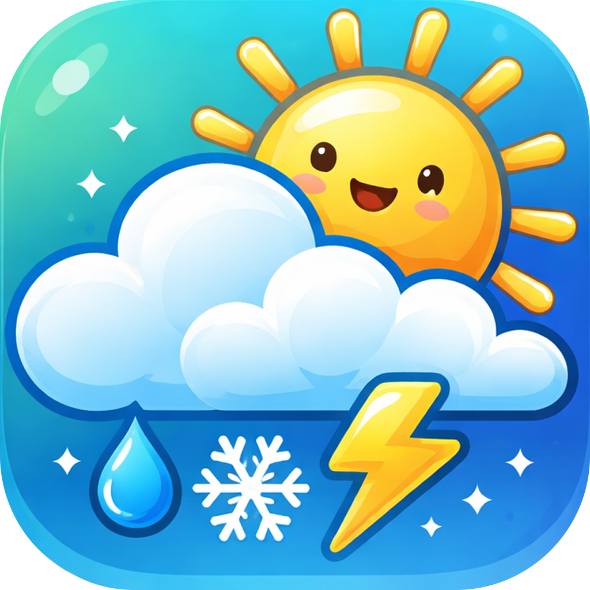

<p align="center">
  
  </p>

<h1 align="center">
   <i>MeteoVision</i>
  </h1>

Um aplicativo de previsão do tempo moderno e elegante para iOS e Android, desenvolvido com React Native.

## 📸 Screenshots / demo


https://github.com/user-attachments/assets/75cf8996-7105-4d73-a895-fcbe273b70a5


## ✨ Funcionalidades

- **Temperatura atual** com sensação térmica
- **Previsão horária** e diária detalhada
- **Nascer e pôr do sol** com visualização animada
- **Índice UV** com escala visual
- **Umidade relativa** do ar
- **Tema dinâmico** que se adapta às condições climáticas
- **Geolocalização automática**
- **Gradientes animados** baseados no clima
- **Interface glassmorphism** moderna
- **Mapa interativo** com satélite híbrido e pin de localização
- **Busca de cidades** com animação de voo até o destino
- **Salvar localizações** e navegar entre elas com swipe horizontal
- **Menu hambúrguer** com lista de localizações salvas e remoção individual
- **Indicador de modo offline** com ícone SVG de sem conexão

## 🛠️ Tecnologias

- **React Native** 0.82.1
- **TypeScript** 5.8.3
- **React** 19.1.1
- **@shopify/restyle** - Sistema de temas e estilos
- **react-native-linear-gradient** - Gradientes animados
- **react-native-geolocation-service** - Serviços de localização
- **react-native-maps** - Mapa interativo com modo satélite
- **react-native-reanimated** 4.x - Animações de voo e UI
- **react-native-svg** - Ícones e gráficos vetoriais
- **@react-native-community/netinfo** - Detecção de conectividade
- **zustand** - Gerenciamento de estado global
- **react-native-mmkv** - Persistência de dados local
- **axios** - Requisições HTTP para API de clima
- **Maestro** - Testes de UI automatizados e gravação de demos

## 📂 Estrutura do Projeto

```
src/
├── api/              # Serviços de API
│   ├── location/     # Geocodificação e busca de cidades (Nominatim)
│   └── weather/      # API de clima (Open-Meteo)
├── assets/           # Recursos estáticos
│   ├── fonts/        # Fontes customizadas
│   └── icons/        # Ícones SVG
├── components/       # Componentes reutilizáveis
│   ├── Box/               # Container com Restyle
│   ├── Text/              # Componente de texto
│   ├── GlassBox/          # Card com efeito glassmorphism
│   ├── Screen/            # Tela com gradiente
│   ├── HourlyForecast/    # Previsão horária
│   ├── DailyForecast/     # Previsão diária
│   ├── SolarDeclination/  # Animação nascer/pôr do sol
│   ├── UvIndexCard/       # Card de índice UV
│   ├── MapSearchBar/      # Barra de busca de cidades no mapa
│   ├── MapLocationCard/   # Card de localização selecionada no mapa
│   └── SavedLocationsMenu/ # Menu hambúrguer com localizações salvas
├── hooks/            # Hooks customizados
│   ├── useLocation.ts          # Hook de geolocalização
│   ├── useWeather.ts           # Hook de dados climáticos
│   ├── useDynamicWeatherTheme.ts # Tema dinâmico
│   ├── useAppTheme.ts          # Tema da aplicação
│   ├── useAppSafeArea.ts       # Safe area
│   ├── useMapSearch.ts         # Busca de cidades com debounce
│   └── useMapPin.ts            # Pin de localização no mapa
├── screens/          # Telas da aplicação
│   └── app/
│       ├── WeatherScreen.tsx   # Tela principal com pager
│       └── MapScreen.tsx       # Tela de mapa interativo
├── store/            # Estado global
│   └── useWeatherStore.ts      # Zustand: localização, clima, salvas
├── storage/          # Persistência
│   └── storage.ts              # MMKV
├── theme/            # Configuração de temas
│   └── theme.ts
└── utils/            # Funções utilitárias
    ├── flyToRegion.ts
    ├── getDailyForecast.ts
    ├── getDayOfWeek.ts
    ├── getWeatherTheme.ts
    ├── weatherCodeToText.ts
    ├── weatherCodeToEmoji.ts
    ├── uvText.ts
    └── humidityText.ts
maestro/
└── demo_mapa.yaml    # Fluxo de demo automatizado com Maestro
```

## 🚀 Como Executar

### Pré-requisitos

- Node.js >= 20
- npm ou yarn
- Xcode (para iOS)
- Android Studio (para Android)
- CocoaPods (para iOS)

### Instalação

1. Clone o repositório:
```bash
git clone https://github.com/seu-usuario/MeteoVision.git
cd MeteoVision
```

2. Instale as dependências:
```bash
npm install
```

3. Para iOS, instale os pods:
```bash
cd ios && pod install && cd ..
```

### Executando

**iOS:**
```bash
npm run ios
```

**Android:**
```bash
npm run android
```

**Iniciar Metro Bundler:**
```bash
npm start
```

## 📝 Scripts Disponíveis

- `npm start` - Inicia o Metro Bundler
- `npm run ios` - Executa o app no iOS
- `npm run android` - Executa o app no Android
- `npm run lint` - Verifica problemas de linting
- `npm test` - Executa os testes

## 🌐 APIs Utilizadas

### Open-Meteo
Obtém dados meteorológicos em tempo real:
- Temperatura atual e aparente
- Previsão horária (24h)
- Previsão diária (7 dias)
- Índice UV
- Umidade relativa
- Horários de nascer e pôr do sol

### OpenStreetMap Nominatim API
- Geocodificação reversa: coordenadas → nome de cidade
- Busca de cidades por nome com até 5 resultados

## 🤖 Testes Automatizados

O projeto usa **Maestro** para testes de UI e gravação de demos.

### Instalar Maestro
```bash
curl -Ls "https://get.maestro.mobile.dev" | bash
```

### Gravar demo do mapa
```bash
# Terminal 1 — inicia gravação
xcrun simctl io booted recordVideo demo_mapa.mp4

# Terminal 2 — executa o fluxo
maestro test maestro/demo_mapa.yaml
```

O fluxo cobre: abrir mapa → buscar cidade → animação de voo → salvar → swipe para a página salva.

## 📄 Licença

Este projeto está sob a licença privada.

## 👨‍💻 Autor

Desenvolvido por [Thiago Marins](https://www.linkedin.com/in/thiagossmarins/)

---

⭐ Se você gostou deste projeto, considere dar uma estrela!
